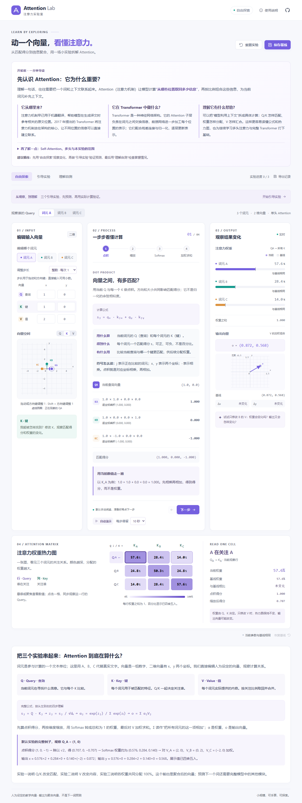
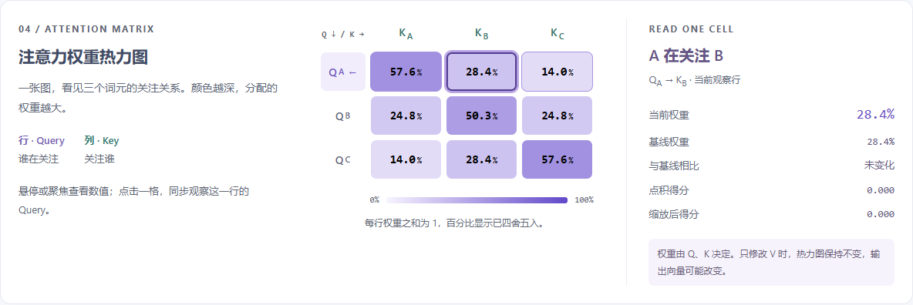
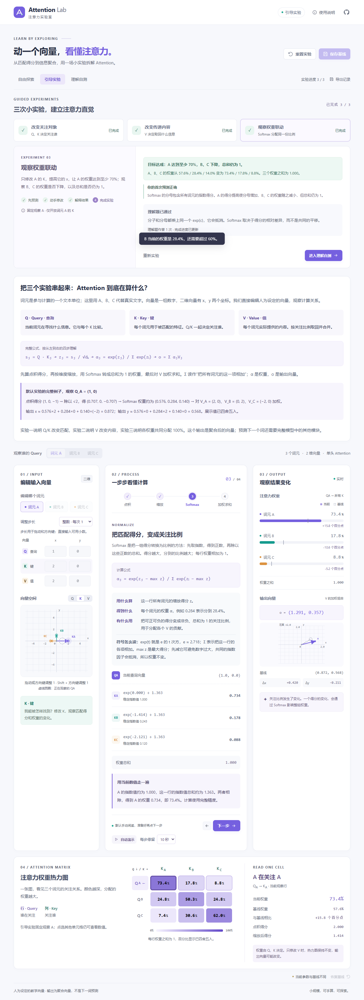

# Attention 实验室

面向 AI 初学者的可控 Attention 教学实验。计算核心、交互网页和第三阶段的引导学习闭环均已完成。

**在线体验：[打开 Attention 实验室](https://zeshanzheng.github.io/attention-lab/)**。电脑或手机浏览器即可使用，无需安装或注册。



## 交互网页

- 学习模式按钮前提供一分钟导读，介绍 Attention 的背景、在 Transformer 中的作用和学习收益。补充说明可展开，解释自注意力、多头、编码器层的简化信息流及本实验范围，并附原始论文链接。
- 独立选择“观察谁的 Query”和“编辑哪个词元”，修改 B 时仍可观察 A。
- 输入或拖动二维 Q/K/V 向量；聚焦数值输入框时，坐标图同步切到对应类型。
- 向量输入按钮、拖动和方向键默认按整数调整，可切换到 0.1 步长；Shift + 方向键调整 1，直接输入仍可使用小数。切换步长不修改当前向量；坐标范围为 −5 到 5。
- 点积、缩放、Softmax、加权求和四个步骤，说明输入、结果、用途、符号含义，并展示随当前参数变化的计算例子。默认手动切换；自动演示可暂停，每步停留 5、10 或 20 秒，默认 10 秒。
- 自由探索底部和最后一个引导实验完成后提供 Q/K/V 定义、完整公式与默认数值例子。
- 权重柱状图、输出向量图及修改前后差值，使用同一份计算结果。
- 3 × 3 Attention 权重热力图展示所有 Query 与 Key 的关注关系，使用固定 0%–100% 色阶和百分比，高亮当前观察行；悬停、聚焦或点选单元格查看点积、缩放得分、基线权重和差值。自由探索中点击或按 Enter 同步切换观察 Query，引导实验保持观察 A。
- 保存当前参数作为比较基线、恢复基线、一键重置。基线保留在当前页面中；刷新页面会回到默认实验。
- 手机布局、键盘操作、使用说明及非法输入反馈。
- 正文常用字号为 14–15px，公式为 16–17px（手机窄屏为 14px），权重数值为 16px，输入数字为 14px；辅助说明颜色加深，兼顾桌面和手机阅读。



热力图的每一行分别归一化，真实权重之和为 1；显示百分比已经四舍五入，合计可能略偏离 100%。颜色越深代表权重越大，色阶随编辑保持一致。只修改 V 时，九格权重和颜色保持不变，输出向量可能改变。参见[手机热力图](docs/images/heatmap-mobile.png)。

## 引导学习与理解自测

每次实验按“先预测 → 动手修改 → 解释结果 → 完成实验”推进，只开放目标向量，固定观察 A 并保留初始基线，避免同时修改多个变量。

| 实验 | 操作 | 学习目标 |
|---|---|---|
| 改变关注对象 | 只改 B 的 K，让 B 权重超过 60% | Q/K 匹配决定关注谁；Q 的零分量不参与点积 |
| 改变传递内容 | 把 B 的 V 从 `(0, 2)` 改为 `(0, 4)` | 权重不变，输出 y 翻倍；V 决定传递的内容 |
| 观察权重竞争 | 只改 A 的 K，让 A 权重至少为 70% | 权重归一化，A 增大时 B/C 减小；共同平移得分不改变 Softmax |



- 先记录预测再开放编辑，自动滚动并聚焦可编辑输入框，紫色边框标出目标向量；固定目标栏持续显示任务，并支持就地检查。达到目标后冻结参数，回到解释区；理解题支持提示与重试。
- 理解自测题库共 20 道，每轮抽取 5 道，分别覆盖匹配得分、信息聚合、权重分配、变化规律和概念边界。题目顺序随机，最近三轮不重复；可在提交前或提交后换题，换题清空本轮答案并回到题目顶部。
- 提交后逐题解释概念、计算步骤和错误选项，首次和最近成绩分别保留。每次保存实际题目、选项、正确答案与解释的快照；旧记录沿用原解释，以后扩充题库不会按新题重算旧成绩。旧版四题记录自动迁移，仍显示原来的四题分母。
- 已完成实验和已提交自测保存到当前浏览器的 `localStorage`，刷新后仍可查看进度。未完成的实验和自由探索参数刷新后重新开始；不同设备或网址的记录不会自动同步。
- “导出记录”下载匿名 JSON，包含首次预测、理解题回答序列、完成时的输入/权重/输出快照，以及自测回答和成绩。不收集姓名，不向服务器发送记录。
- 实验与自测历史分别最多保留 30 条；各实验首次完成和首次自测会保留。重复练习不覆盖首次错误，不能把重试后的分数当作首次掌握情况。
- 切回自由探索会恢复本次页面中之前的参数；重置引导实验保留已经完成的学习记录。浏览器无法保存时仍可学习并导出，但刷新后新增记录不会保留。

参见[理解自测截图](docs/images/assessment.png)、[手机引导截图](docs/images/guided-mobile.png)和[真人试用流程](docs/user-testing.md)。已收到两位同学的初步试用反馈，并据此改进教学说明与操作引导；此次小样本试用不构成严格的学习效果评估。

## 当前能力

- 标准计算：`softmax(Q Kᵀ / √d_k) V`。
- 返回逐坐标乘积、原始匹配得分、缩放得分、遮罩后得分、权重、各 V 的加权贡献以及输出向量。
- 稳定 Softmax：先减最大得分，避免指数溢出。
- 可选布尔 Mask：`true` 为可见，`false` 为屏蔽；至少保留一个可见 Key。
- 支持多个 Query、任意正向量维度，以及与 Q/K 维度不同的 V。
- 验证空矩阵、维度不一致、非有限数字、全部屏蔽及计算溢出。
- 纯函数，不修改输入、不使用随机数、不依赖网络或 API Key。

教学边界：默认向量为人工设定，直接提供 Q/K/V，没有从真实模型提取语义向量。点积是匹配得分，不是余弦相似度；Attention 输出是聚合向量，不是下一词预测。位置编码、投影矩阵、多头、残差和完整 Transformer 不在本阶段范围内。

## 10 分钟复现

在线发布由 GitHub Actions 自动执行；查看[部署和更新说明](docs/deployment.md)或[部署进度](https://github.com/ZeshanZheng/attention-lab/actions/workflows/deploy-pages.yml)。本地开发与在线发布互不影响。

### Windows：使用本项目运行环境

在项目根目录的 PowerShell 中执行：

```powershell
powershell -NoProfile -ExecutionPolicy Bypass -File scripts/setup.ps1
powershell -NoProfile -ExecutionPolicy Bypass -File scripts/run.ps1 -Task install
powershell -NoProfile -ExecutionPolicy Bypass -File scripts/run.ps1 -Task dev
```

打开 **http://127.0.0.1:5173**。保持运行命令所在的终端开启；按 Ctrl+C 停止开发服务器。

`setup.ps1` 从 Node.js 官网下载 Node.js **24.12.0** Windows x64 压缩包，核对官方 SHA256 后解压到 `.tools/`，不修改系统 PATH。依赖与 npm 缓存均保留在项目内。首次下载需要网络；后续计算、测试和演示均在本地执行。

`install` 在存在锁文件时使用 `npm ci`。使用以下命令执行检查：

```powershell
powershell -NoProfile -ExecutionPolicy Bypass -File scripts/run.ps1 -Task verify
powershell -NoProfile -ExecutionPolicy Bypass -File scripts/run.ps1 -Task test:browser
```

`verify` 依次运行计算核心与前端的严格类型检查、35 项数学/边界/实验状态/学习流程/题库测试、核心与网页编译以及默认实验演示；任何一步失败都会返回失败。

`test:browser` 对构建后的网页执行 24 项真实浏览器验收，默认使用已安装的 Microsoft Edge 无头模式，并自动启动、关闭预览服务器。覆盖整数/小数调整、实际数值教学例子、手动阅读与可暂停播放、手机实验定位与固定目标、基线管理、热力图九格数值与 Query 联动、三个实验全流程、错误预测与重试、自测详细解析、换题与首次成绩、旧版记录迁移、进度刷新、题目快照 JSON 导出、存储异常及手机布局。截图保存在 `.tools/`，失败时保留测试追踪。

### 已有 Node.js 的环境

使用 Node.js 24.12.0 或更高的 24.x 版本（复现实测版本为 24.12.0）：

```sh
npm ci
npm run dev
```

检查与构建：

```sh
npm run verify
npm run test:browser
```

如果没有安装 Edge，可以先执行 `npx playwright install chromium`，再通过 `PLAYWRIGHT_CHANNEL=chromium` 环境变量运行浏览器测试。PowerShell 中设置方式为 `$env:PLAYWRIGHT_CHANNEL = 'chromium'`；在 Linux/macOS 中可以执行 `PLAYWRIGHT_CHANNEL=chromium npm run test:browser`。

没有环境变量要求，没有服务器或数据库要求。安装版本由 `package-lock.json` 固定。原生 TypeScript 执行负责运行示例和测试，TypeScript 编译器单独执行类型检查。

## 默认实验与预期结果

关注词元 A 的 Query：`[1, 0]`。

| 词元 | Q | K | V |
|---|---|---|---|
| A | `[1, 0]` | `[1, 0]` | `[2, 0]` |
| B | `[0, 1]` | `[0, 1]` | `[0, 2]` |
| C | `[-1, 0]` | `[-1, 0]` | `[-2, 0]` |

| 步骤 | 词元 A 的计算结果，显示值已四舍五入 |
|---|---|
| 点积 | `[1, 0, -1]` |
| 缩放 | `[0.707107, 0, -0.707107]` |
| 权重 | `[0.575975, 0.283995, 0.140029]` |
| 输出 | `[0.871892, 0.567991]` |
| 只把 B 的 V 改为 `[0, 4]` | 权重不变；输出为 `[0.871892, 1.135982]` |

运行 `npm run demo` 或下面的 PowerShell 命令，查看未经舍入的完整中间结果和修改前后对比：

```powershell
powershell -NoProfile -ExecutionPolicy Bypass -File scripts/run.ps1 -Task demo
```

## 后续界面如何调用

```typescript
import { computeAttention, createDefaultExperiment } from './src/index.ts';

const experiment = createDefaultExperiment();
const result = computeAttention(experiment.input);
const queryIndex = experiment.selectedQueryIndex;

// 柱状图、公式和输出使用同一次计算的结果。
console.log(result.scaledScores[queryIndex]);
console.log(result.weights[queryIndex]);
console.log(result.contributions[queryIndex]);
console.log(result.outputs[queryIndex]);

// 参数变化后，用新输入重新计算，不修改旧基线。
const changed = computeAttention({
  ...experiment.input,
  values: experiment.input.values.map((value, index) =>
    index === 1 ? [0, 4] : [...value]),
});
console.log(changed.outputs[queryIndex]);
```

`queries` 形状为 `[queryCount, d_k]`；`keys` 为 `[keyCount, d_k]`；`values` 为 `[keyCount, d_v]`。得分和权重形状为 `[queryCount, keyCount]`，输出为 `[queryCount, d_v]`。

`dotProducts` 的索引为 `[query][key][Q/K 坐标]`；`contributions` 为 `[query][key][V 坐标]`。计算保留完整精度，界面自行控制显示小数位。

Mask 中屏蔽位置的 `maskedScores` 为 `-Infinity`。JSON 序列化会将这个值变成 `null`；保存实验时应保存有限的输入向量和布尔 Mask，再重新计算结果。

编译后计算核心入口位于 `dist/index.js`。网页构建产物单独位于 `site-dist/`，不会覆盖计算核心；可通过 `npm run preview` 或 `scripts/run.ps1 -Task preview` 在 **http://127.0.0.1:4173** 查看。源码不依赖 Node API；测试和命令行示例使用 Node。

## 项目结构

```text
src/
  core/attention.ts                  计算核心与数值验证
  presets/default-experiment.ts      三词元默认教学实验
  index.ts                          公共入口
tests/attention.test.ts              数学与边界测试
tests/lab-state.test.ts              基线、重置与输入验证测试
tests/learning.test.ts               实验目标、流程门禁、记录与自测测试
tests/assessment.test.ts             题库抽取、数学核对、快照与旧记录迁移
tests/browser/lab.spec.ts            真实浏览器交互验收
tests/browser/heatmap.spec.ts        热力图数值、基线、键盘与手机验收
tests/browser/learning.spec.ts       引导学习与记录持久化验收
web/                                React 界面、实验状态与 SVG 图表
  learning/                         课程、会话、学习记录与本地保存
examples/default-experiment.ts       可运行的修改前后演示
scripts/                            Windows 本地环境与运行脚本
docs/development/                    本次需求、开发与验证记录
docs/user-testing.md                真人试用流程与评价边界
docs/user-testing-template.csv      空白试用记录模板
docs/user-testing-template.xlsx     带样式和填写说明的 Excel 空白模板
```

## 开发记录与比赛材料

参见 [第一次迭代记录](docs/development/01-calculation-core.md)、[第二次迭代记录](docs/development/02-interactive-interface.md) 和 [第三次迭代记录](docs/development/03-guided-learning.md)。Git 历史将工程初始化、计算模块、交互界面与引导学习分开记录。GitHub 仓库：[ZeshanZheng/attention-lab](https://github.com/ZeshanZheng/attention-lab)。

在线发布的配置与实际验收见[第四次迭代记录](docs/development/04-online-deployment.md)。

题库扩充、换题与历史兼容见[第五次迭代记录](docs/development/05-assessment-bank.md)。

热力图的设计与验证见[第六次迭代记录](docs/development/06-attention-heatmap.md)。

字号与文字对比度调整见[第七次迭代记录](docs/development/07-readable-typography.md)。

两位同学的试用反馈、新手教学说明与操作引导改进见[第八次迭代记录](docs/development/08-beginner-feedback.md)。

Attention 背景导读、Transformer 中的位置及学习路线见[第九次迭代记录](docs/development/09-attention-introduction.md)。

开发记录只是摘要，不等同于完整 AI 对话。应保留三个阶段的原始对话或截图/录屏，按比赛要求展示真实 Prompt、修改建议、约束与修复过程；三个功能阶段本身不能替代完整 Prompt 链。

数学依据：[Attention Is All You Need](https://papers.neurips.cc/paper/2017/file/3f5ee243547dee91fbd053c1c4a845aa-Paper.pdf)。运行方式依据：[Node.js TypeScript 文档](https://nodejs.org/docs/latest-v24.x/api/typescript.html)。
